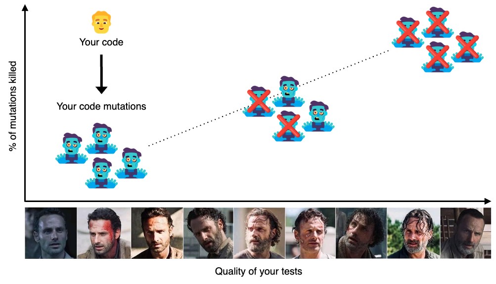
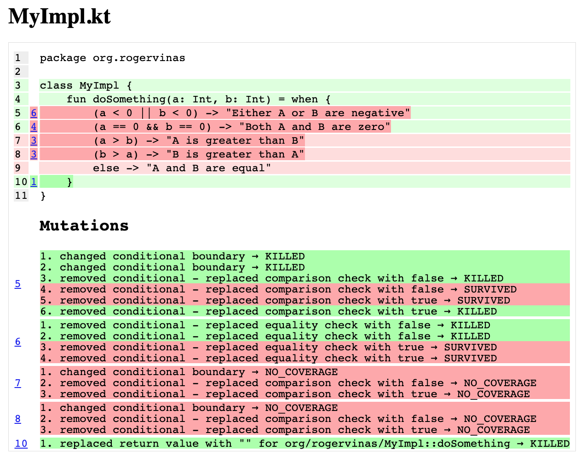
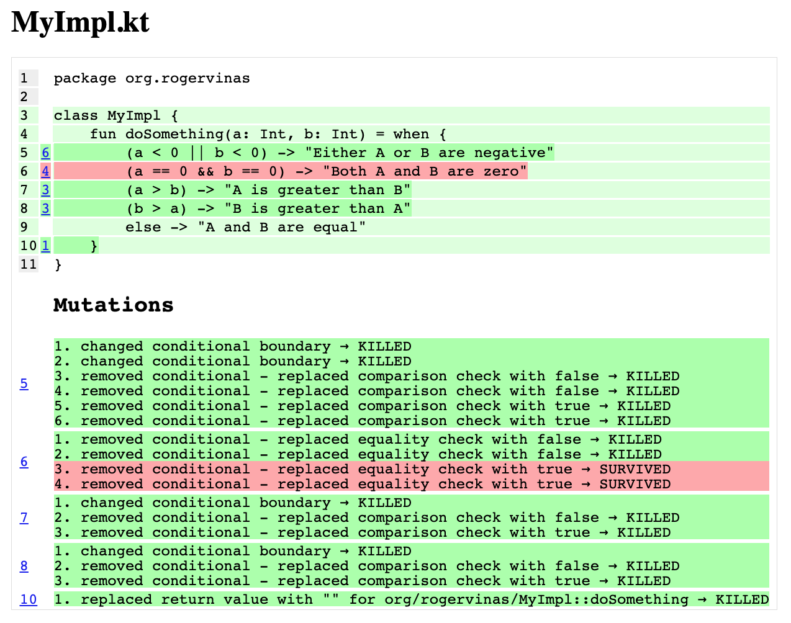

[](https://github.com/rogervinas/mutation-testing/actions/workflows/gradle.yml)


# Mutation Testing with Pitest and Kotlin

[Mutation Testing](https://en.wikipedia.org/wiki/Mutation_testing) is a way to evaluate the quality of our tests by modifying ("mutating") our code and counting how many of these modifications ("mutations") do not pass the tests ("are killed"). 

**The greater the number of mutations killed the better!**

Let me visualize it with this [The Walking Dead](https://www.imdb.com/title/tt1520211/) reference:



In this PoC I want to use [Pitest](https://pitest.org/) and [Kotlin](https://kotlinlang.org/) to see how this works in practice.

## Gradle project setup

First we start creating a gradle project with kotlin DSL and [gradle-pitest-plugin](https://plugins.gradle.org/plugin/info.solidsoft.pitest).

In `build.gradle.kts` we declare the plugin:
```kotlin
plugins {
    id("info.solidsoft.pitest") version "1.9.11"
}
```

And we [configure it](https://github.com/szpak/gradle-pitest-plugin#plugin-configuration):
```kotlin
configure<PitestPluginExtension> {
    junit5PluginVersion.set("1.0.0")
    avoidCallsTo.set(setOf("kotlin.jvm.internal"))
    mutators.set(setOf("STRONGER"))
    targetClasses.set(setOf("org.rogervinas.*"))
    targetTests.set(setOf("org.rogervinas.*"))
    threads.set(Runtime.getRuntime().availableProcessors())
    outputFormats.set(setOf("XML", "HTML"))
    mutationThreshold.set(75)
    coverageThreshold.set(60)
}
```
* We specify in `targetClasses` where our "to be mutated" code is and in `targetTests` where our tests are.
* We can specify a `mutationThreshold` in % so any value below that will make the test fail. In this case I expect at least 75% of the mutations to be killed.
* We can also specify a `coverageThreshold` in % for the minimum line coverage that we want to ensure. In this example I've set it to 60%.

## Implementation

The implementation we are going to test is quite simple:
```kotlin
class MyImpl {
    fun doSomething(a: Int, b: Int) = when {
        (a < 0 || b < 0) -> "Either A or B are negative"
        (a == 0 && b == 0) -> "Both A and B are zero"
        (a > b) -> "A is greater than B"
        (b > a) -> "B is greater than A"
        else -> "A and B are equal"
    }
}
```

## Test

For the test we use a [Junit5 Parameterized test](https://junit.org/junit5/docs/current/user-guide/#writing-tests-parameterized-tests):
```kotlin
internal class MyImplTest {

    @ParameterizedTest
    @CsvSource(
        value = [
            "0, 0, Both A and B are zero",
            // other cases ...
        ]
    )
    fun `should do something`(a: Int, b: Int, expectedResult: String) {
        assertThat(MyImpl().doSomething(a, b)).isEqualTo(expectedResult)
    }
}
```

## Mutation Testing with Pitest

Let's execute **Pitest** but only with one test case `0, 0, Both A and B are zero` and see what happens:

```shell
> ./gradlew pitest

================================================================================
- Statistics
================================================================================
>> Line Coverage: 5/8 (63%)
>> Generated 17 mutations Killed 7 (41%)
>> Mutations with no coverage 6. Test strength 64%
>> Ran 11 tests (0.65 tests per mutation)
Enhanced functionality available at https://www.arcmutate.com/
Exception in thread "main" java.lang.RuntimeException:
Mutation score of 41 is below threshold of 75
```

The test fails because from 17 mutations generated only 7 were killed, that is 41%, below the expected threshold of 75% 😟

If we examine the **Pitest** report generated in `build/reports/pitest` we can check all the mutations applied to each line:



Then, what if we add all the test cases?

```shell
> ./gradlew pitest

================================================================================
- Statistics
================================================================================
>> Line Coverage: 8/8 (100%)
>> Generated 17 mutations Killed 15 (88%)
>> Mutations with no coverage 0. Test strength 88%
>> Ran 44 tests (2.59 tests per mutation)
```

We are on the right path, now our line coverage is 100% and from 17 mutations generated all except 2 were killed, that is 88%, above our expected threshold of 75% 😃

But wait a minute ... why are there 2 surviving mutations if I added all the possible test cases? 🤔

Let's check the **Pitest** report again:



Can you help me find the missing test cases? Post your solution as a pull request! 🙏

Thanks and happy coding! 💙
